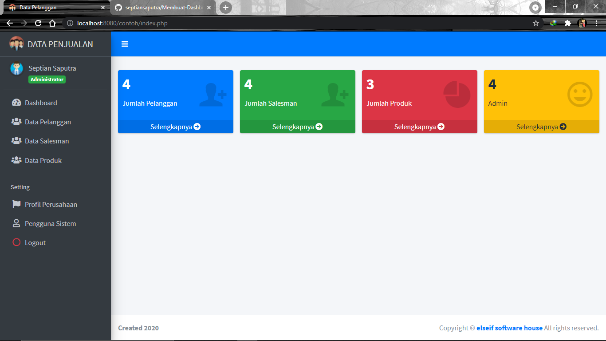
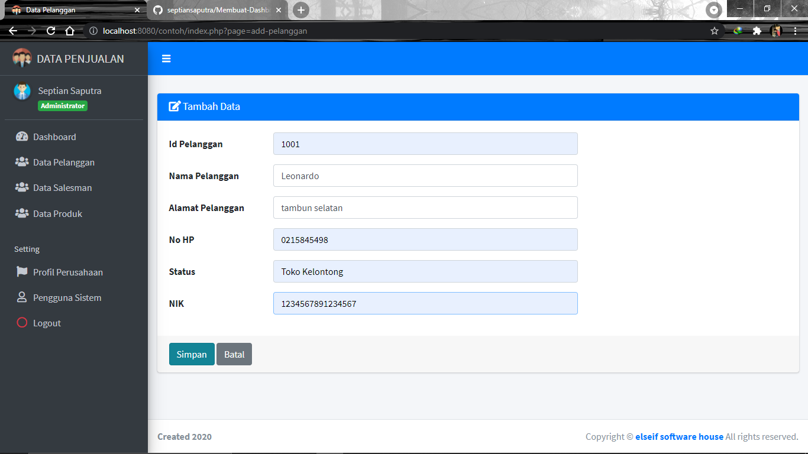
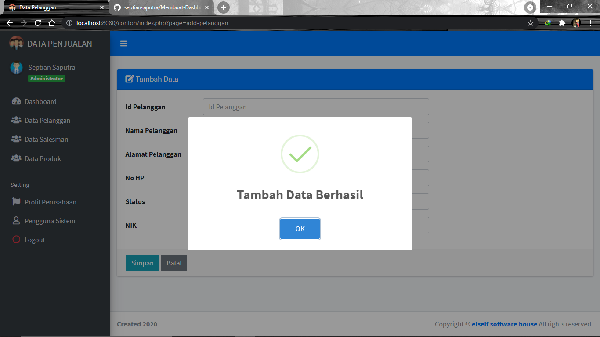
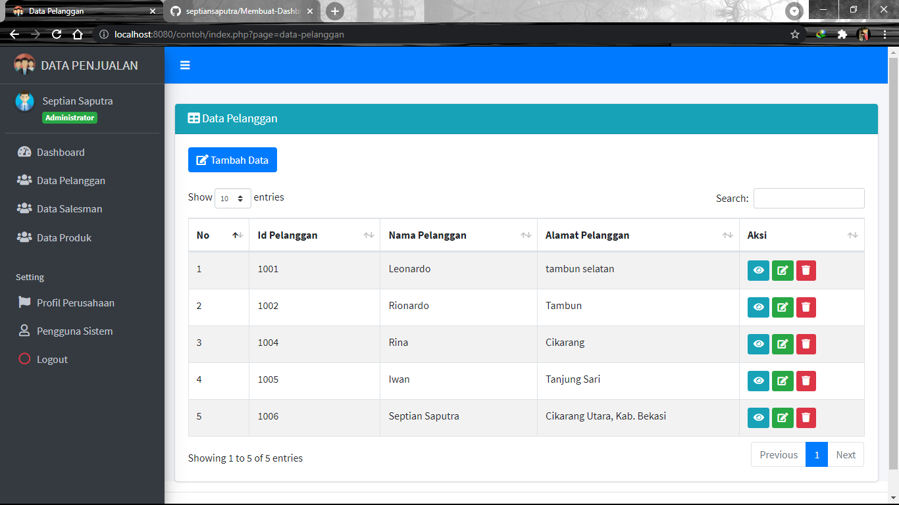
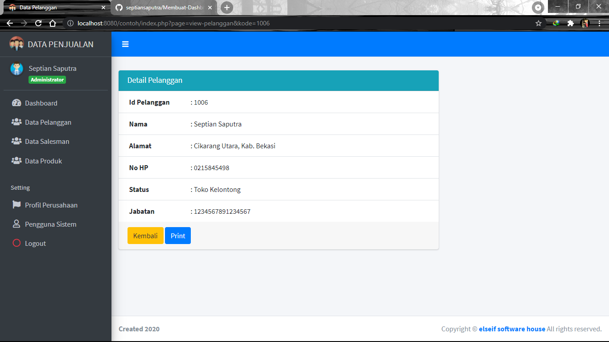
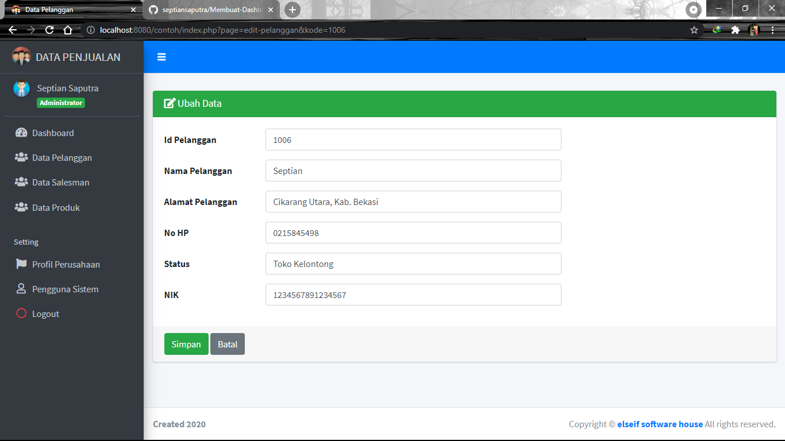
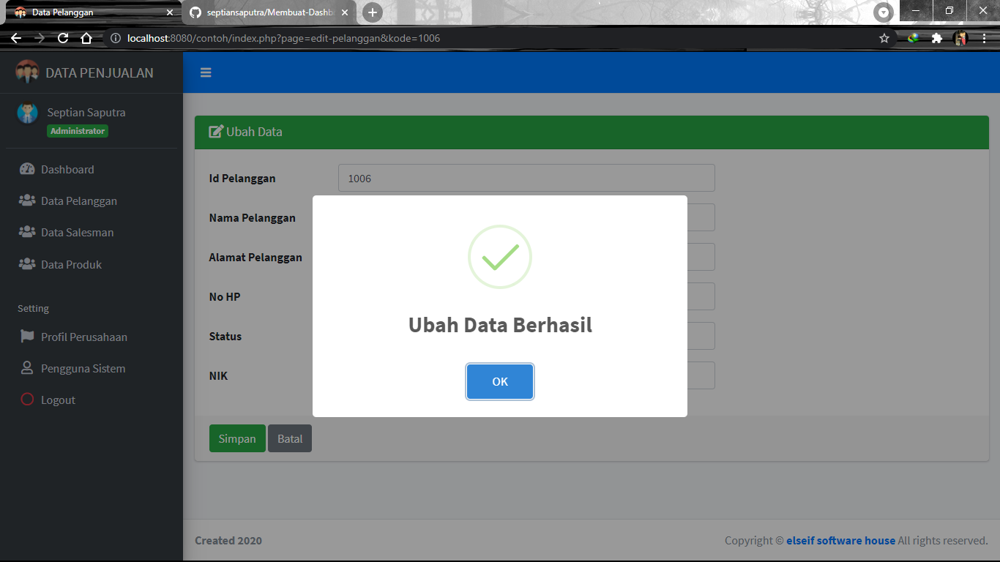
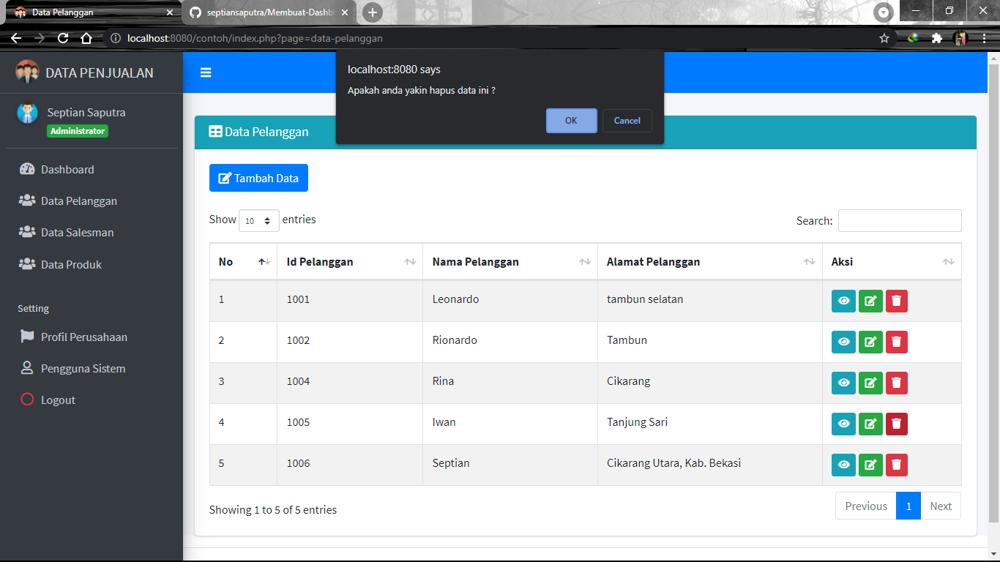
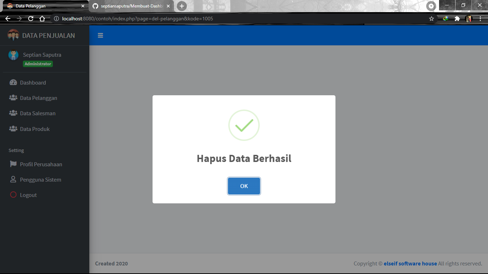
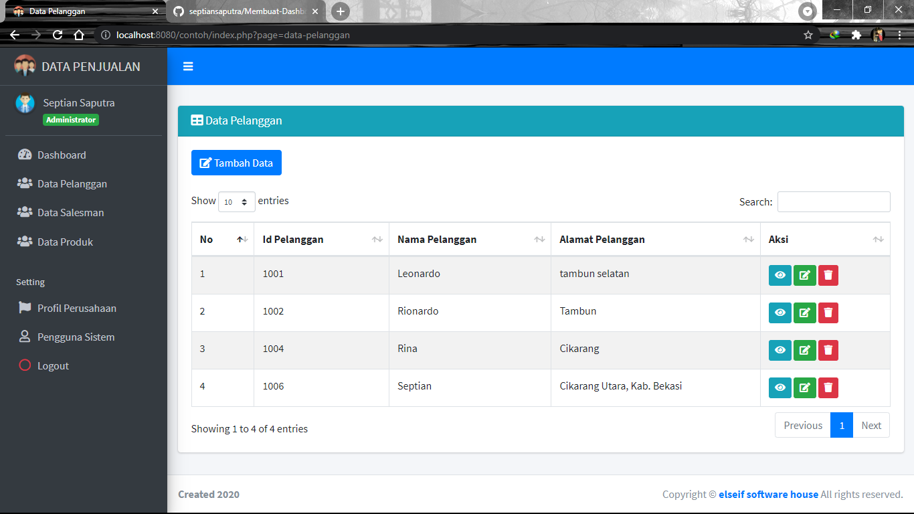

# MEMBUAT_DASHBOARD&CRUD

1. Tampilan Dashboard

2. Data Pelanggan

3. Tambah Pelanggan

4. Berhasil Tambah Data Pelanggan

5. Menampilkan Data Baru

6. Menampilkan Detail Pelanggan

7. Mengubah Data Pelanggan

8. Berhasil Ubah Data Pelanggan

9. Menampilkan Data yang di Ubah

10. Menghapus Data Pelanggan

11. Berhasil Menghapus Data Pelanggan

12. Menampilkan Data

